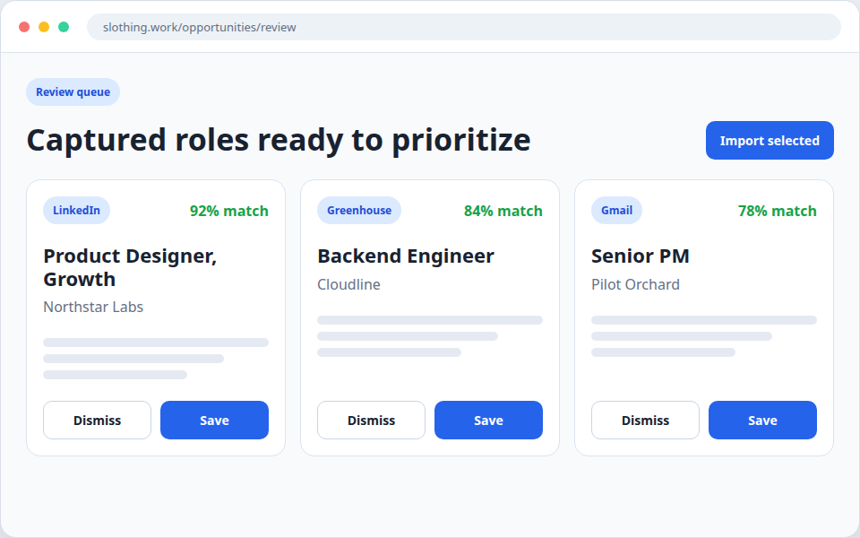
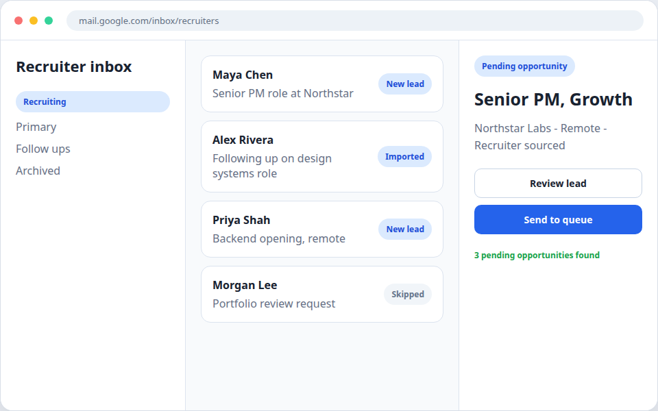
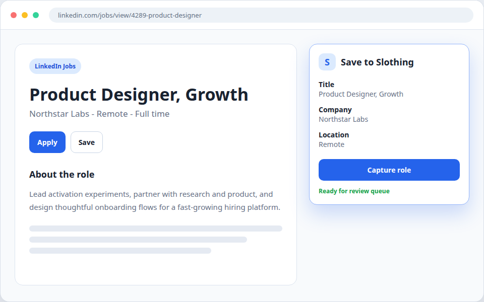

# Slothing — open-source job application assistant

> You're not lazy. Your job search system is.

[](./LICENSE)
[](./ROADMAP.md)

**Open source. Privacy-first. Self-host free, or use [slothing.work](https://slothing.work) weekly while you are actively searching.**

Slothing is your personal job-application command center. Upload your career
documents, build tailored resumes and cover letters in one workspace, track
opportunities, and prepare for interviews. AI does the heavy lifting; you keep
your data.

| You want… | Use… |
|---|---|
| Full control, run it on your own machine | **Self-host** (this repo, free forever) |
| No setup, login and go | **[slothing.work](https://slothing.work)** ($6.99/wk or $19.99/mo) |
| Try the hosted app with your own OpenAI/Anthropic key | **slothing.work Free tier** (bring-your-own-key) |

The hosted version is the same code as this repo plus a small proprietary
billing module. See [LICENSING.md](./LICENSING.md) for how the open-core split
works.

---

## Why Slothing

Most job-search tools either store your résumé in their database forever or
charge $30/month indefinitely for features you only need during an active
search. Slothing inverts both:

- **Your data is yours.** Self-host and nothing leaves your machine. On the
  hosted version, delete your account at any time and the data goes with you.
- **Pay weekly.** The hosted plan is built around the assumption that you
  *shouldn't* be using Slothing forever. $6.99/wk means you can spin up during
  a job hunt and stop paying the moment you land an offer.
- **Open source, not "source available".** Real AGPL v3. You can read every
  line of the AI prompts, scraping logic, and scoring algorithms that touch
  your data.

## Features

- **Document Studio** — Unified resume + cover letter workspace at `/studio`
  with templates, version history, and a TipTap-backed editor.
- **Knowledge Bank** — Upload résumés, cover letters, and supporting docs;
  AI extracts structured profile data you can reuse across applications.
- **Opportunity Tracker** — Jobs and hackathons in one pipeline (`/opportunities`),
  with a review queue for scraped/extension/inbound listings.
- **AI Tailoring** — Paste a JD, get a tailored résumé and cover letter pulled
  from your knowledge bank. Multi-provider: OpenAI, Anthropic, Ollama, OpenRouter.
- **Interview Prep** — Text and voice mock interviews with AI feedback.
- **Columbus Browser Extension** — Auto-fill applications, scrape job postings
  into your tracker, bulk import from WaterlooWorks.
- **Google Integration** — Calendar sync, Drive import/backup, Gmail import/send,
  Docs/Sheets export.
- **Analytics, Calendar, Salary tools, Email templates** — the rest of the
  command center.

## Screenshots

| Columbus review queue | Gmail import | Job-board capture |
|---|---|---|
|  |  |  |

## Tech stack

- **Framework**: Next.js 14 (App Router) on a Turborepo + pnpm monorepo
- **Language**: TypeScript (strict)
- **Database**: libSQL/Turso with Drizzle (better-sqlite3 locally)
- **Auth**: NextAuth v5 (Google OAuth + optional Resend magic links)
- **AI**: OpenAI, Anthropic, Ollama (local/free), or OpenRouter — your pick
- **UI**: Tailwind CSS + shadcn/ui patterns, semantic-token design system
- **Editor**: TipTap
- **Testing**: Vitest (unit) + Playwright (e2e)

---

## Self-host quickstart

You'll have a fully functional Slothing running locally in about three minutes.

### Prerequisites

- Node.js 18+
- pnpm 9+
- (Optional) Ollama for free local AI — install from [ollama.ai](https://ollama.ai)

### Install and run

```bash
pnpm install
cp .env.example apps/web/.env.local
pnpm dev
```

Open [http://localhost:3000](http://localhost:3000).

### Single-user dev mode (no Google OAuth)

If you just want to poke around without setting up Google OAuth, add this to
`apps/web/.env.local`:

```env
NEXTAUTH_URL=http://localhost:3000
NEXTAUTH_SECRET=$(openssl rand -base64 32)
NEXT_PUBLIC_NEXTAUTH_ENABLED=false
SLOTHING_ALLOW_UNAUTHED_DEV=1
TURSO_DATABASE_URL=file:./.local.db
```

All requests are served as the `default` user. Don't ship this in production —
it has no auth.

### Pick an AI provider

**Option 1 — Ollama (free, local, recommended for self-host):**

```bash
ollama pull llama3.2
```

Then in Slothing → Settings, select "Ollama" and click Test connection.

**Option 2 — Bring your own API key:**

Settings → pick OpenAI / Anthropic / OpenRouter → paste your key → Test
connection. Your key stays in your local database and is never sent anywhere
except directly to the LLM provider.

### Deploying

For a real self-hosted deployment with Docker Compose, env vars, BYOK setup,
and backup guidance, see [`docs/self-hosting.md`](./docs/self-hosting.md).

---

## Google integration (optional)

Connect your Google account to enable:

- **Calendar Sync** — interview schedules with Google Calendar
- **Drive** — import résumés from Drive, back up generated documents
- **Gmail** — import job-related emails, send emails directly
- **Docs/Sheets** — export interview notes to Docs, analytics to Sheets
- **Contacts/Tasks** — save recruiter contacts, sync reminders

Setup:

1. Set `GOOGLE_CLIENT_ID`, `GOOGLE_CLIENT_SECRET`, and `NEXTAUTH_SECRET` in
   `apps/web/.env.local`.
2. Set the Google OAuth redirect URI to
   `http://localhost:3000/api/auth/callback/google`.
3. In Slothing → Settings → Google Integrations, click **Connect Google Account**.

See [`docs/google-integration/README.md`](docs/google-integration/README.md) for
the full guide.

## Columbus browser extension

Columbus is Slothing's browser-extension sub-brand. It auto-fills job
applications and imports listings into your opportunity tracker.

**Build it:**

```bash
pnpm --filter @slothing/extension build:chrome    # → apps/extension/dist/
pnpm --filter @slothing/extension build:firefox   # → apps/extension/dist-firefox/
```

**Load it:**

- Chrome: `chrome://extensions` → Developer mode → Load unpacked → pick
  `apps/extension/dist/`
- Firefox: `about:debugging#/runtime/this-firefox` → Load Temporary Add-on → pick
  `apps/extension/dist-firefox/manifest.json`

**Try the demo first:**

```bash
node apps/extension/demo/launch-with-extension.mjs
```

Boots a Chromium with the extension pre-loaded and opens a sample job-application
form so you can see scraping, the badge, and popup behavior end-to-end.

**Connect:** click the Slothing icon → **Connect Account** → opens
`/extension/connect` on your locally-running Slothing, generates a token tied to
your session. After connecting, `Cmd+Shift+F` auto-fills, `Cmd+Shift+I` imports.

**WaterlooWorks bulk import:** when on `waterlooworks.uwaterloo.ca`, the popup
shows a **Detected: WaterlooWorks** section with single-posting, visible-rows,
and full-set scrape buttons (paginated, capped at 200). See
[`apps/extension/README.md`](./apps/extension/README.md#5-waterlooworks-bulk-import).

**New permission:** Columbus requests `webNavigation` so it can detect user-driven step changes inside Workday and Greenhouse application flows after you start autofill. The extension does not collect browsing history and does not submit applications. If the permission is unavailable, Columbus falls back to asking before filling each new step. See [docs/extension-release-followthrough-2026-05.md](./docs/extension-release-followthrough-2026-05.md) for the release note and verification checklist.

Full docs: [`apps/extension/README.md`](./apps/extension/README.md).

---

## Project structure

```
apps/
├── web/
│   ├── src/                  # Next.js pages, components, lib, hooks
│   │   └── cloud/            # Proprietary hosted-only code (see LICENSING.md)
│   ├── drizzle/              # Database migrations
│   ├── e2e/                  # Playwright tests
│   └── evals/                # Resume + cover-letter eval harness
└── extension/                # Columbus browser extension
packages/
└── shared/
    └── src/                  # Shared types, Zod schemas, formatters, scoring
```

Run commands from the repo root:

```bash
pnpm install
pnpm dev                    # Web dev server on port 3000
pnpm run type-check         # TypeScript strict
pnpm run test:run           # Vitest one-shot (used in CI)
pnpm run lint               # Next lint + forbidden-color check
pnpm run build              # Production build
```

Package-scoped:

```bash
pnpm --filter @slothing/web db:migrate
pnpm --filter @slothing/web test:e2e
pnpm --filter @slothing/extension build
```

Vercel should use `apps/web` as the project Root Directory, or build from the
repo root with the Turborepo pipeline.

## Data storage

Application data lives in libSQL/Turso (schema:
`apps/web/src/lib/db/schema.ts`). Local development defaults to
`file:./.local.db`. Hosted deployments set `TURSO_DATABASE_URL` and, when
required, `TURSO_AUTH_TOKEN`.

Locally:

- `.local.db` — libSQL database
- `uploads/` — uploaded documents
- `public/resumes/` — generated résumé files
- Browser localStorage (`taida:` prefix) — Studio version history snapshots

## Document Studio

`/studio` is the single document-building workspace. Resume and cover-letter
creation share one header, file panel, document canvas, and AI assistant area.

```
/studio
├── Header
│   ├── Resume / Cover Letter tabs
│   ├── Template picker
│   ├── Save status
│   └── Export (Copy HTML / Download PDF)
├── Left drawer (collapsible)
│   ├── Files
│   ├── Version history
│   └── Knowledge bank entry picker
├── Center
│   └── TipTap-backed document preview/editor
└── Right drawer (collapsible)
    └── AI Assistant
```

The Studio file panel tracks resume and cover-letter files separately while
keeping users in the same workspace. Version history helpers normalize, compare,
and store capped snapshots in browser storage under
`taida:builder:versions:<document-id>`.

See [`docs/architecture.md`](./docs/architecture.md) for a deeper architectural
overview with diagrams.

---

## Evals

Resume and cover-letter generation evals live under `apps/web/evals/`. Run
`pnpm --filter @slothing/web eval -- --mode=resume --limit=5` with an LLM key,
or set `EVAL_OFFLINE=1` for a deterministic local smoke run. See
[`docs/evals.md`](docs/evals.md) for cases, metrics, report formats, and judge
options.

## Contributing

Contributions are welcome under the AGPL-3.0 license that governs this repo.
By submitting a pull request you agree your contribution is licensed under
AGPL-3.0 (same as the rest of the project — there is no CLA).

If your PR modifies files inside `apps/web/src/cloud/`, that's proprietary code
and we'll need a separate conversation about licensing. See
[LICENSING.md](./LICENSING.md).

Before opening a PR:

- `pnpm run type-check` passes
- `pnpm run test:run` passes
- `pnpm run lint` passes (this includes the forbidden-color hard-fail check —
  never use raw `bg-white`/`text-gray-*`/hex colors, use semantic tokens)
- Pre-commit hook runs `lint-staged` + type-check; don't bypass with
  `--no-verify`

## Roadmap

See [ROADMAP.md](./ROADMAP.md).

## License

This repository is licensed under the
[GNU Affero General Public License v3](./LICENSE), with one small proprietary
carve-out for hosted-only billing code under `apps/web/src/cloud/`. See
[LICENSING.md](./LICENSING.md) for the full breakdown.

"Slothing" and "Columbus" are unregistered trademarks of Kevin Jiang.
