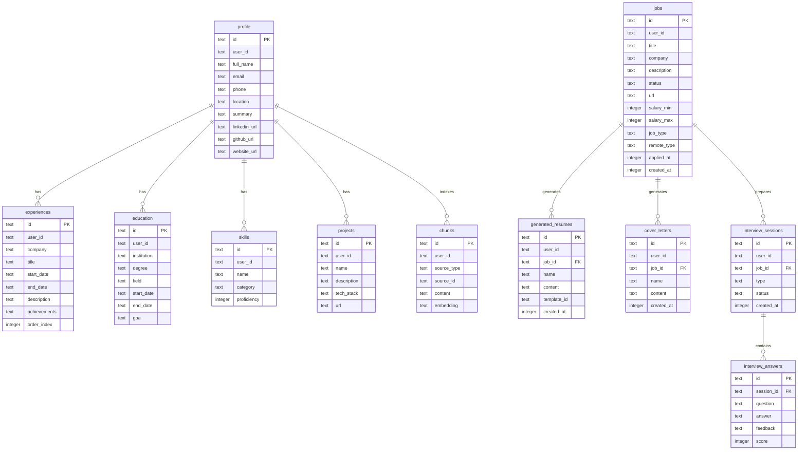
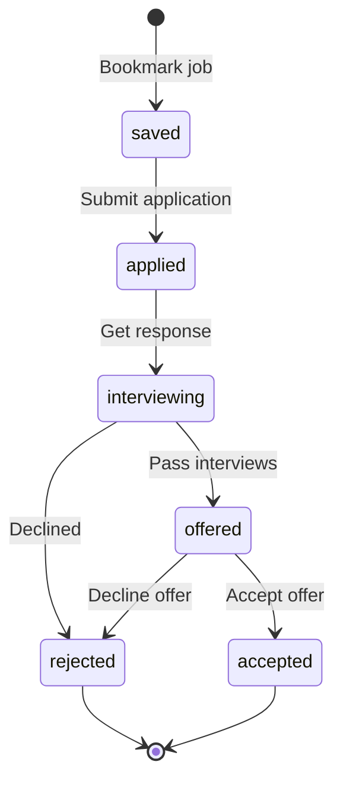
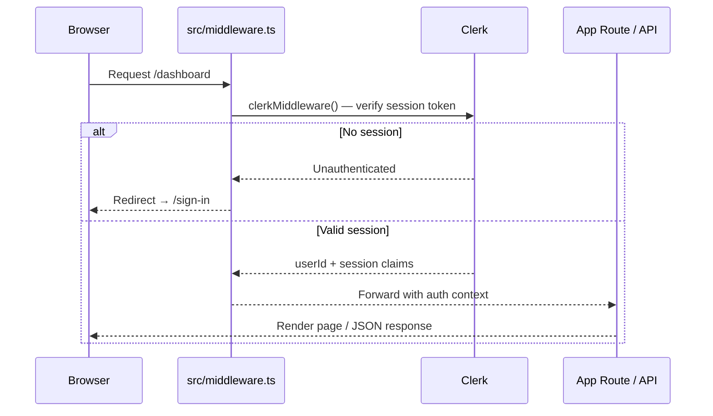
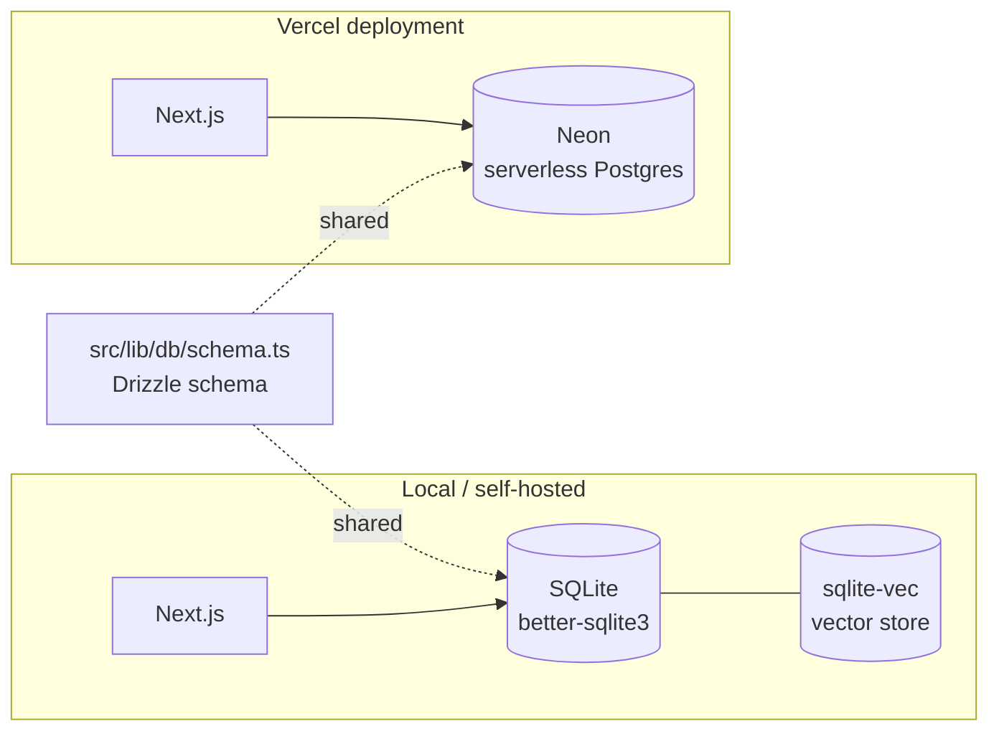
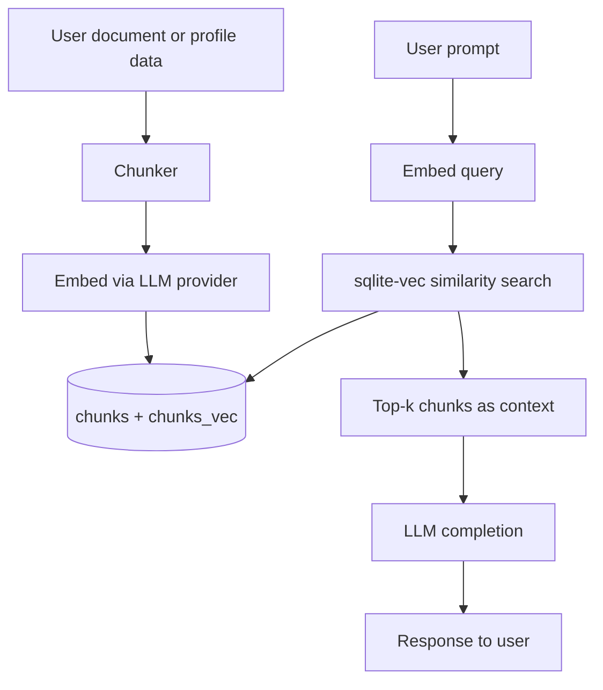
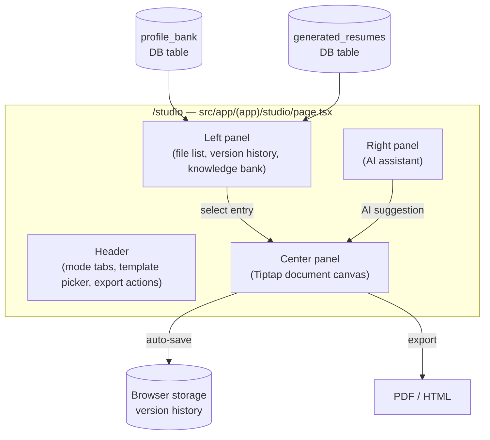
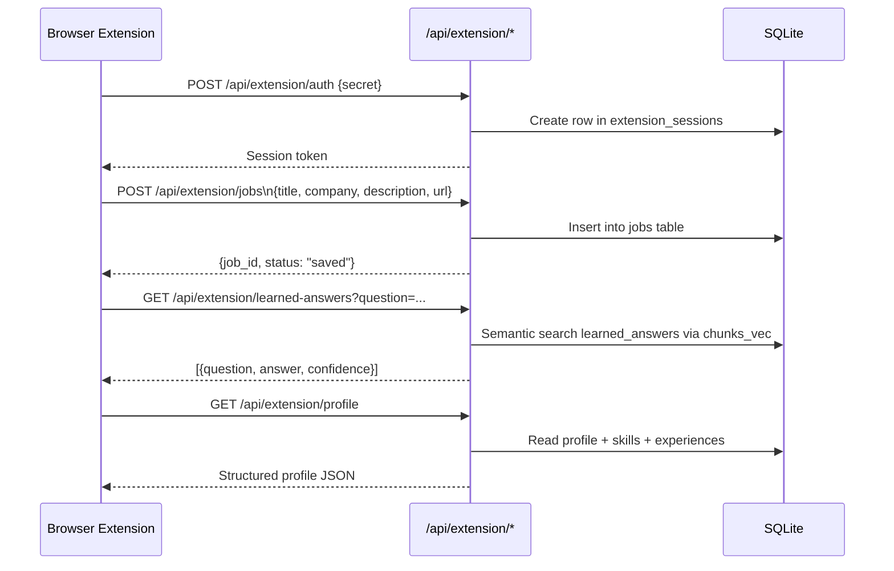
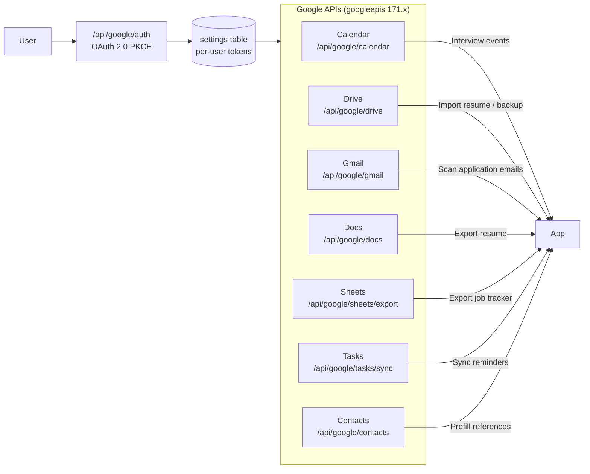
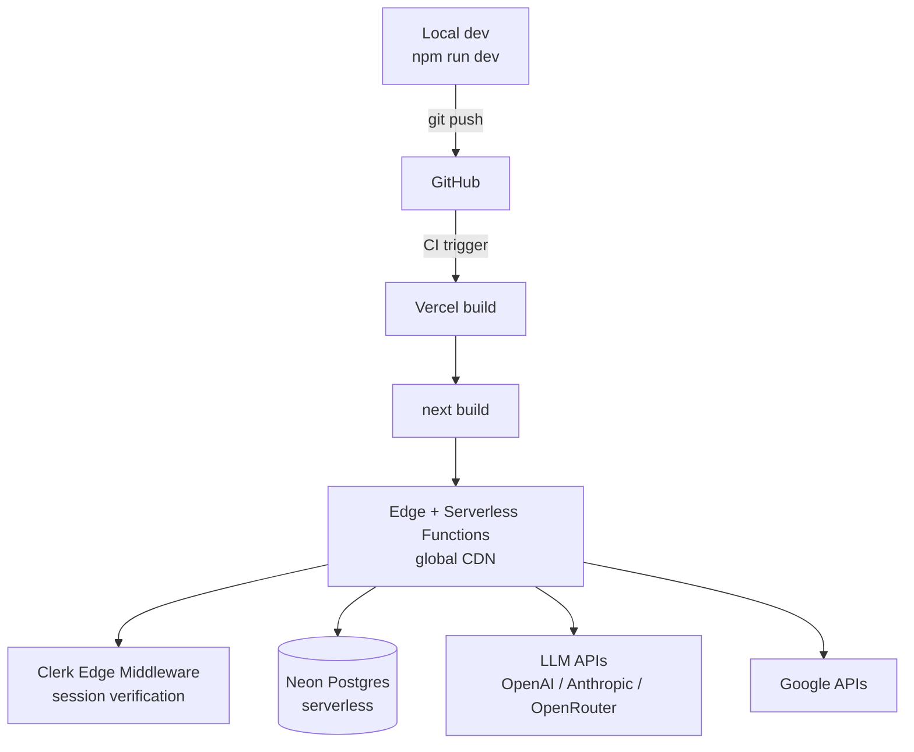
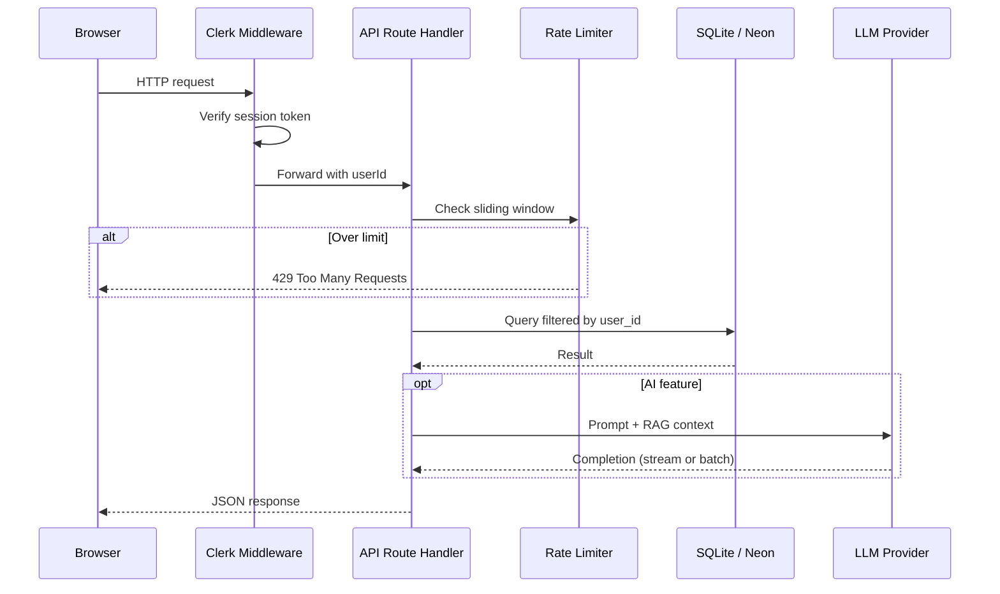

# Architecture

Get Me Job (Taida) is an AI-powered job application assistant built on Next.js 14 App Router. This document covers the full system architecture: tech stack, directory layout, data model, authentication, database, AI integrations, browser extension, and deployment.

---

## Tech Stack

| Layer | Technology | Version |
|-------|------------|---------|
| Framework | Next.js (App Router) | 14.x |
| Language | TypeScript (strict mode) | 5.x |
| Styling | Tailwind CSS + CSS Variables | 3.x |
| Components | Radix UI + CVA | — |
| Rich Text | Tiptap | 3.x |
| Database | SQLite (better-sqlite3) | 11.x |
| ORM | Drizzle ORM | 0.45 |
| Cloud DB | Neon (serverless Postgres) | 1.x |
| Auth | Clerk | 6.x |
| LLM | OpenAI / Anthropic / Ollama / OpenRouter | — |
| Animations | Framer Motion | 11.x |
| Validation | Zod | 4.x |
| Testing | Vitest (unit) + Playwright (e2e) | — |

---

## Directory Structure

```
src/
├── app/
│   ├── (app)/               # Authenticated app routes (Clerk-protected)
│   │   ├── dashboard/
│   │   ├── studio/          # Unified Document Studio (resume + cover letter)
│   │   ├── jobs/            # Job tracker + company research
│   │   ├── opportunities/   # Opportunity pipeline
│   │   ├── profile/         # Contact, experience, education, skills
│   │   ├── interview/       # Interview prep (text + voice)
│   │   ├── analytics/       # Application funnel analytics
│   │   ├── calendar/        # Calendar view + iCal feed
│   │   ├── emails/          # Email draft generator
│   │   ├── settings/        # LLM provider configuration
│   │   ├── documents/       # Document manager
│   │   ├── bank/            # Knowledge bank
│   │   ├── salary/          # Salary negotiation tracker
│   │   ├── extension/       # Browser extension setup
│   │   └── recommendations/ # Job recommendations
│   ├── (marketing)/         # Public landing page
│   └── api/                 # Next.js route handlers
│       ├── jobs/
│       ├── tailor/          # AI resume tailoring
│       ├── cover-letter/
│       ├── interview/
│       ├── profile/
│       ├── google/          # Google Workspace integrations
│       ├── extension/       # Browser extension API
│       ├── analytics/
│       ├── ats/
│       └── ...
├── components/
│   ├── ui/                  # Base primitives (Button, Card, Dialog, …)
│   ├── layout/              # Sidebar, navigation
│   ├── studio/              # Document Studio canvas + preview shell
│   ├── builder/             # Studio section controls
│   └── [feature]/           # Feature-specific components
├── lib/
│   ├── db/                  # schema.ts + per-table query files
│   ├── llm/                 # Provider-agnostic LLM client
│   ├── builder/             # Studio state, export, version history
│   ├── editor/              # TipTap ↔ JSON conversion helpers
│   ├── resume/              # Parsing + generation
│   ├── ats/                 # ATS scoring
│   ├── interview/           # Interview prep logic
│   ├── rate-limit.ts        # Sliding-window rate limiter
│   ├── api-utils.ts         # Shared API error helpers
│   └── constants.ts         # Path constants, provider lists
├── hooks/                   # Custom React hooks
└── types/                   # Shared TypeScript types
```

---

## Data Model

### Entity relationships



### Additional tables

| Table | Purpose |
|-------|---------|
| `job_status_history` | Tracks every status transition per job |
| `salary_offers` | Compensation details tied to a job |
| `reminders` | Follow-up reminders with due dates |
| `ats_scan_history` | ATS compatibility reports per resume/job pair |
| `company_research` | Cached company research results |
| `learned_answers` | Q&A pairs captured from previous applications |
| `documents` | Uploaded files (PDF, DOCX, TXT) |
| `profile_bank` | Aggregated content bank for resume generation |
| `profile_versions` | Versioned snapshots of the profile |
| `custom_templates` | User-defined resume templates |
| `analytics_snapshots` | Daily funnel metrics for trending |
| `resume_ab_tracking` | A/B test results across resume versions |
| `email_drafts` | Generated follow-up email drafts |
| `notifications` | In-app notification queue |
| `extension_sessions` | Browser extension auth tokens |
| `field_mappings` | Custom field mappings for job board forms |
| `settings` | Per-user LLM config and preferences |

### Job status pipeline



---

## Authentication Flow (Clerk)

Clerk handles authentication via its Next.js SDK (`@clerk/nextjs`). The middleware runs on every non-static request.



**Public routes** (no auth required):
- `/` — marketing landing page
- `/sign-in/*`, `/sign-up/*` — Clerk-hosted auth UI
- `/api/webhooks/*` — Clerk webhook callbacks

**Graceful degradation:** If `NEXT_PUBLIC_CLERK_PUBLISHABLE_KEY` is absent (local dev without Clerk), `middleware.ts` passes all routes through as public so the app runs without a Clerk account.

---

## Database

### SQLite (development / self-hosted)

The primary store is a local SQLite file via `better-sqlite3`. All queries are **synchronous**, keeping API route code simple with no `await` chains.

```
data/get-me-job.db          ← default path
                               override: GET_ME_JOB_SQLITE_PATH env var
```

Drizzle ORM owns the schema in `src/lib/db/schema.ts` and generates migrations with `drizzle-kit`. The `sqlite-vec` extension adds a `chunks_vec` virtual table for fast vector similarity search (RAG).

### Neon (cloud / Vercel production)

`@neondatabase/serverless` is a drop-in serverless Postgres driver. The Drizzle schema is database-agnostic — switching to Neon is a driver swap, not a schema rewrite.



---

## AI Integrations

### LLM client (`src/lib/llm/client.ts`)

A single `LLMClient` class wraps all providers behind a uniform interface:

```typescript
const client = new LLMClient(config);

// Non-streaming
const text = await client.complete({ messages, temperature, maxTokens });

// Streaming (AsyncGenerator)
for await (const chunk of client.stream({ messages })) { ... }
```

| Provider | Default model | Endpoint |
|----------|---------------|----------|
| OpenAI | `gpt-4o-mini` | `https://api.openai.com/v1/chat/completions` |
| Anthropic | `claude-3-haiku-20240307` | `https://api.anthropic.com/v1/messages` |
| Ollama | `llama3.2` | `http://localhost:11434/api/chat` |
| OpenRouter | `meta-llama/llama-3.2-3b-instruct:free` | `https://openrouter.ai/api/v1/chat/completions` |

Active provider and model are stored in the `settings` table and configured at `/settings`.

### Where AI is used

| Feature | API route | Purpose |
|---------|-----------|---------|
| Resume tailoring | `POST /api/tailor` | Match profile to JD, rewrite bullets |
| Tailor autofix | `POST /api/tailor/autofix` | Rewrite flagged resume gaps |
| Cover letter | `POST /api/cover-letter/generate` | Draft or revise cover letter |
| Interview questions | `POST /api/interview/start` | Generate role-specific questions |
| Answer feedback | `POST /api/interview/answer` | Score and critique answers |
| Prep guide | `POST /api/interview/prep-guide` | Company research digest |
| Company research | `POST /api/research/company` | Summarise company info |
| ATS scan | `POST /api/ats` | Score resume against JD keywords |
| Email drafts | `POST /api/email` | Generate follow-up emails |
| Job insights | `POST /api/insights` | Personalised application advice |

### RAG pipeline

Profile data and uploaded documents are chunked, embedded, and stored in `chunks` / `chunks_vec`. When generating AI content, the most relevant chunks are retrieved as context.



All LLM-backed API routes are protected by the sliding-window rate limiter in `src/lib/rate-limit.ts`.

---

## Document Studio Architecture

`/studio` is the single in-app workspace for building resume and cover letter documents. Legacy `/builder`, `/tailor`, and `/cover-letter` routes redirect there.



Version snapshots are stored in `localStorage` under `taida:builder:versions:<document-id>`, capped at `MAX_BUILDER_VERSIONS`. TipTap JSON is the editor data contract; `src/lib/editor/bank-to-tiptap.ts` converts knowledge bank entries into TipTap nodes.

---

## Browser Extension Architecture

The extension captures job postings directly from job boards and surfaces learned answers when filling application forms.



**Key tables for the extension:**

| Table | Role |
|-------|------|
| `extension_sessions` | Authenticates extension requests with a shared secret |
| `learned_answers` | Q&A pairs from past applications, surfaced when filling forms |
| `field_mappings` | Custom mappings for non-standard form fields on job boards |

---

## Google Workspace Integration



---

## Deployment (Vercel)



### Required environment variables

| Variable | Purpose |
|----------|---------|
| `NEXT_PUBLIC_CLERK_PUBLISHABLE_KEY` | Clerk public key |
| `CLERK_SECRET_KEY` | Clerk server key |
| `OPENAI_API_KEY` | OpenAI LLM access |
| `ANTHROPIC_API_KEY` | Anthropic LLM access |
| `OPENROUTER_API_KEY` | OpenRouter access |
| `GOOGLE_CLIENT_ID` | Google OAuth client ID |
| `GOOGLE_CLIENT_SECRET` | Google OAuth secret |
| `GET_ME_JOB_SQLITE_PATH` | Override SQLite file path (optional) |

For Vercel, set `DATABASE_URL` to a Neon connection string and switch the Drizzle adapter; the schema requires no changes.

---

## Request Lifecycle



---

## Security

| Concern | Approach |
|---------|---------|
| Authentication | Clerk JWT verified on every request via `src/middleware.ts` |
| User isolation | All DB tables include `user_id`; every query filters by it |
| Rate limiting | Sliding-window limiter on all LLM-backed routes (`src/lib/rate-limit.ts`) |
| File uploads | Magic-byte validation before processing — not just MIME type |
| ID generation | `crypto.randomBytes()` — not `Math.random()` |
| API error messages | Generic messages via `src/lib/api-utils.ts`; stack traces never exposed |
| API keys | `.env.local` (dev) or Vercel environment variables (prod), never committed |

---

## Key Design Decisions

**Single-route Document Studio** — Resume and cover letter editing share `/studio`, one header, and one AI assistant panel. Legacy routes redirect there so the codebase has one document-editing surface to maintain.

**SQLite-first, Neon optional** — SQLite keeps local development zero-config and fast. The Drizzle schema is database-agnostic; switching to Neon is a driver swap.

**Provider-agnostic LLM client** — `LLMClient` hides per-provider HTTP differences (Anthropic's request shape, Ollama's local endpoint, OpenRouter's routing). Adding a provider means implementing `complete` and `stream`.

**Synchronous DB queries** — `better-sqlite3` is synchronous. At single-user SQLite scale this is a performance non-issue, and it eliminates callback chains in API handlers.

**Browser storage for version history** — Resume draft snapshots live in `localStorage` (capped at `MAX_BUILDER_VERSIONS`). This keeps intermediate drafts out of the database while giving users undo history.
