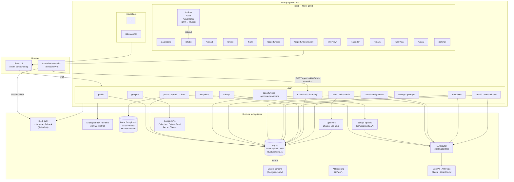

# Architecture Overview

Taida (repo: `get-me-job`) is a Next.js 14 App Router application. SQLite for storage, multi-provider LLM, Clerk for auth (with a local-dev fallback), and a Columbus browser extension that feeds opportunities into a review queue.

This doc is the canonical architecture reference. The older uppercase `ARCHITECTURE.md` was retired during the May 2026 UX audit.

---

## Tech Stack

| Layer | Technology |
|-------|------------|
| Framework | Next.js 14 (App Router) |
| Language | TypeScript (strict) |
| Styling | Tailwind CSS + semantic CSS variables (forbidden-color lint) |
| Components | Shadcn/ui patterns + CVA |
| Database | SQLite via better-sqlite3 (WAL); Drizzle schema ready for Postgres |
| Auth | Clerk (`lib/auth.ts`) with `default` local-dev fallback |
| LLM | OpenAI / Anthropic / Ollama / OpenRouter via `lib/llm/client.ts` |
| Editor | TipTap (resume + cover letter) |
| Testing | Vitest (unit) + Playwright (e2e) |

---

## Diagram 1 — Route tree + subsystems

This shows the user-facing routes, the API surface they call into, and the runtime subsystems each API route depends on.

### How the pieces fit

- **Auth.** Every API route resolves the user via `lib/auth.ts`. If Clerk env vars are present, requests come from Clerk; otherwise we fall back to a single `default` user (or the `x-get-me-job-e2e-user` header for E2E).
- **DB.** SQLite is the system of record. Schema bootstrap and additive migrations live in `lib/db/schema.ts`. Every user-owned table has a `user_id` column and an index on it. The Drizzle schema mirrors this for an eventual Postgres migration.
- **File uploads.** Stored on disk under the `PATHS.UPLOADS` directory and recorded in the `documents` table with a sha256 `file_hash` for dedupe (see T1).
- **Scrape pipeline.** `/api/opportunities/scrape` and the Columbus extension feed `/opportunities/review`. Items only enter the tracked list after the user accepts them.
- **ATS scoring.** `lib/ats/*` analyzes resumes against job descriptions and persists results in `ats_scan_history`.
- **LLM router.** `lib/llm/client.ts` selects a provider per the user's settings. All LLM-touching API routes are rate-limited.
- **Embeddings.** Knowledge bank chunks are embedded and stored in the `chunks_vec` virtual table (sqlite-vec). Vector search degrades gracefully if the extension fails to load.
- **Google APIs.** OAuth flow + delegated scopes for Calendar / Drive / Gmail / Docs / Sheets / Contacts / Tasks.

---

## Diagram 2 — Database ER (selected tables)

This is the core of the schema. User-isolation columns (`user_id`) and FK ON-DELETE behavior are shown explicitly because they're easy to miss when adding new queries.

```mermaid
erDiagram
  PROFILE ||--o{ EXPERIENCES : has
  PROFILE ||--o{ EDUCATION : has
  PROFILE ||--o{ SKILLS : has
  PROFILE ||--o{ PROJECTS : has
  PROFILE ||--o{ CERTIFICATIONS : has
  PROFILE ||--o{ PROFILE_VERSIONS : snapshots

  DOCUMENTS ||--o{ PROFILE_BANK : "source for"
  DOCUMENTS ||--o{ CUSTOM_TEMPLATES : "source for"

  JOBS ||--o{ GENERATED_RESUMES : "tailored for"
  JOBS ||--o{ COVER_LETTERS : "drafted for"
  JOBS ||--o{ INTERVIEW_SESSIONS : "prep for"
  JOBS ||--o{ JOB_STATUS_HISTORY : audit
  JOBS ||--o{ REMINDERS : triggers
  JOBS ||--o{ EMAIL_DRAFTS : "context for"
  JOBS ||--o{ ATS_SCAN_HISTORY : "scored against"
  JOBS ||--o{ SALARY_OFFERS : "offer for"
  JOBS ||--o{ RESUME_AB_TRACKING : tracks

  GENERATED_RESUMES ||--o{ RESUME_AB_TRACKING : variant

  INTERVIEW_SESSIONS ||--o{ INTERVIEW_ANSWERS : "answered with"

  CHUNKS ||--|| CHUNKS_VEC : "embedding for"

  DOCUMENTS {
    text id PK
    text user_id "default 'default'"
    text filename
    text type
    text mime_type
    int  size
    text path
    text extracted_text
    text parsed_data
    text file_hash "sha256 — T1 dedupe"
    text uploaded_at
  }

  PROFILE {
    text id PK "default 'default'"
    text contact_json
    text summary
    text raw_text
    text created_at
    text updated_at
  }

  EXPERIENCES {
    text id PK
    text profile_id FK
    text company
    text title
    text location
    text start_date
    text end_date
    int  current
    text description
    text highlights_json
    text skills_json
  }

  PROFILE_BANK {
    text id PK
    text user_id
    text category
    text content
    text source_document_id FK "ON DELETE SET NULL"
    real confidence_score
    text created_at
  }

  CHUNKS {
    text id PK
    text user_id
    text content
    text section_type
    text source_file
    text metadata
    real confidence_score
    text superseded_by
    text hash "UNIQUE(user_id, hash) — T1 dedupe"
    text created_at
  }

  CHUNKS_VEC {
    blob embedding "float[1536]"
  }

  JOBS {
    text id PK
    text user_id
    text title
    text company
    text location
    text type
    int  remote
    text salary
    text description
    text requirements_json
    text responsibilities_json
    text keywords_json
    text url
    text status "saved · applied · interviewing · offer · rejected · dismissed"
    text applied_at
    text deadline
    text notes
    text linked_resume_id
    text linked_cover_letter_id
    text created_at
  }

  GENERATED_RESUMES {
    text id PK
    text user_id
    text job_id FK
    text profile_id FK
    text content_json
    text pdf_path
    real match_score
    text created_at
  }

  COVER_LETTERS {
    text id PK
    text user_id
    text job_id FK "ON DELETE CASCADE"
    text profile_id FK
    text content
    text highlights_json
    int  version
    text created_at
  }

  INTERVIEW_SESSIONS {
    text id PK
    text user_id
    text job_id FK
    text profile_id FK
    text mode
    text questions_json
    text status
    text started_at
    text completed_at
  }

  INTERVIEW_ANSWERS {
    text id PK
    text user_id
    text session_id FK "ON DELETE CASCADE"
    int  question_index
    text answer
    text feedback
    text created_at
  }

  ATS_SCAN_HISTORY {
    text id PK
    text user_id
    text job_id FK "ON DELETE SET NULL"
    int  overall_score
    text letter_grade
    int  formatting_score
    int  structure_score
    int  content_score
    int  keywords_score
    int  issue_count
    int  fix_count
    text report_json
    text scanned_at
  }

  EMAIL_DRAFTS {
    text id PK
    text user_id
    text type
    text job_id FK "ON DELETE SET NULL"
    text subject
    text body
    text context_json
    text created_at
    text updated_at
  }

  SALARY_OFFERS {
    text id PK
    text user_id
    text job_id FK "ON DELETE SET NULL"
    text company
    text role
    real base_salary
    real signing_bonus
    real annual_bonus
    real equity_value
    int  vesting_years
    text location
    text status
    text notes
    text negotiation_outcome
    real final_base_salary
    real final_total_comp
  }

  RESUME_AB_TRACKING {
    text id PK
    text resume_id FK "ON DELETE CASCADE"
    text job_id FK "ON DELETE CASCADE"
    text user_id
    text outcome
    text sent_at
    text updated_at
    text notes
  }

  REMINDERS {
    text id PK
    text user_id
    text job_id FK "ON DELETE CASCADE"
    text type
    text title
    text description
    text due_date
    int  completed
    int  dismissed
  }

  JOB_STATUS_HISTORY {
    text id PK
    text user_id
    text job_id FK "ON DELETE CASCADE"
    text from_status
    text to_status
    text changed_at
    text notes
  }

  PROFILE_VERSIONS {
    text id PK
    text user_id
    text profile_id FK
    int  version
    text snapshot_json
    text created_at
  }

  CUSTOM_TEMPLATES {
    text id PK
    text user_id
    text name
    text source_document_id FK "ON DELETE SET NULL"
    text analyzed_styles
    text created_at
  }
```

### Dedupe constraints (T1)

- `documents.file_hash` is sha256 of file bytes; `idx_documents_user_file_hash` makes per-user collision lookup O(log n). Re-uploading an identical file should short-circuit and return the existing document instead of inserting a duplicate.
- `chunks` has `UNIQUE(user_id, hash)` on `idx_chunks_user_hash`. Insertion code must hash the chunk content first and either skip or merge on conflict.
- `profile_bank.source_document_id` is indexed by `idx_profile_bank_user_source` for cascade-delete and dedupe lookups.
- The dashboard activity feed dedupes by stable hash IDs derived from event content (`src/components/dashboard/recent-activity.tsx`).

### Other tables not pictured

- `analytics_snapshots` (per-day rollups), `company_research`, `notifications`, `settings`, `prompt_variants` / `prompt_variant_results`.
- Extension: `extension_sessions`, `learned_answers`, `field_mappings`.

---

## Data flow — typical "tailor a resume" request

1. User clicks **Tailor** in `/studio` → React calls `POST /api/tailor`.
2. The API route resolves `userId` via `lib/auth.ts` and applies the rate limiter.
3. Knowledge bank chunks are pulled from `chunks` and (optionally) ranked via vector search against `chunks_vec`.
4. The selected provider in `lib/llm/client.ts` is called with the JD + ranked bank entries.
5. The result is persisted into `generated_resumes` and surfaced back to Studio.
6. Studio's TipTap editor renders the result. Snapshots flow through `lib/builder/version-history.ts` and are kept under `taida:builder:versions:<id>` in browser storage.

---

## Common pitfalls / things future agents miss

1. **Never hardcode `bg-white`, `bg-black`, or any grayscale Tailwind class.** `npm run lint` runs `scripts/forbidden-color-lint.cjs` which is a hard fail. Use semantic tokens (`bg-card`, `bg-paper`, `bg-background`, `bg-muted`) or CSS variables. Same for inline `style={{ color: "#fff" }}` — use `var(--token)`.
2. **Destructive actions need confirm or undo.** Read `docs/destructive-actions-pattern.md` before adding any delete / archive / reset. Pattern A = `useConfirmDialog` for hard deletes, Pattern B = `useUndoableAction` for reversible status changes. Update the Current Actions table when you add a new flow.
3. **`/jobs` is gone (T2).** All jobs UI lives at `/opportunities`. The DB table is still `jobs`; the API has `/api/opportunities` plus `/api/jobs/*` legacy aliases that share the same table. Don't add a sidebar item for `/jobs`.
4. **`/builder`, `/tailor`, `/cover-letter` are 308 redirect-only.** Resume + cover letter editing happens in `/studio`. If you're tempted to build new UI in those routes, you're in the wrong place.
5. **Always scope DB queries by `user_id`.** Even in dev mode the schema requires it. Resolve via `lib/auth.ts`. Don't write `WHERE id = ?` without a `user_id` predicate on user-owned tables.
6. **Schema changes are additive migrations**, not rewrites. Use the `PRAGMA table_info` + `ALTER TABLE ADD COLUMN` pattern already in `lib/db/schema.ts`. Existing dev DBs depend on it. If you must rebuild a table (e.g., changing UNIQUE constraints), do it inside a transaction + RENAME swap like the `company_research` and `settings` migrations do.
7. **Don't bypass dedupe constraints.** When ingesting documents, hash bytes first and check `documents.file_hash`. When inserting chunks, hash content and let the unique index reject duplicates (or use `INSERT OR IGNORE`).
8. **Pluralization and time formatting are centralized.** Use `pluralize()` from `lib/text/pluralize.ts` and the helpers in `lib/format/time.ts` (or `<TimeAgo />`). Locale is user-configurable; raw `Date.toLocaleString()` calls slip past locale handling.
9. **Hash IDs must be stable.** The dedupe pipeline and dashboard activity feed depend on deterministic hashes. Don't fall back to `Math.random()` for IDs — use `crypto.randomBytes()` server-side or a stable content hash client-side.
10. **Pre-commit hook runs lint-staged + type-check.** If a hook fails, fix the underlying problem; don't pass `--no-verify` to skip it.
11. **Inbound opportunities go through `/opportunities/review`.** New ingestion paths (URL scrape, Columbus extension, future ATS integrations) must land in the review queue, not directly in the tracked list.
12. **The TipTap document JSON is the editor data contract.** Bank entries and cover letter entries are converted via `lib/editor/bank-to-tiptap.ts` and `lib/editor/cover-letter-tiptap.ts`. Don't mutate TipTap nodes by hand — go through the helpers so HTML export and version history stay consistent.
13. **sqlite-vec is optional.** If the extension fails to load (`chunks_vec` create fails), vector search degrades gracefully. Don't write code that assumes the virtual table is always present.
14. **Pre-rendered SEO metadata is per-route.** Page components are client-side; titles/descriptions live in `src/lib/seo.ts` and are exported from each route's `layout.tsx`. New routes need an entry in both.
15. **Rate-limit anything that hits an LLM.** Wrap new LLM endpoints with the limiter from `lib/rate-limit.ts` so a runaway client can't burn the provider quota.

---

## See also

- `CLAUDE.md` — agent instructions (conventions, common tasks, recent improvements)
- `docs/destructive-actions-pattern.md` — T8 confirm/undo convention
- `docs/RAG-ARCHITECTURE.md` — knowledge bank + embeddings detail
- `docs/API.md` — endpoint reference
- `ROADMAP.md` — what's next
